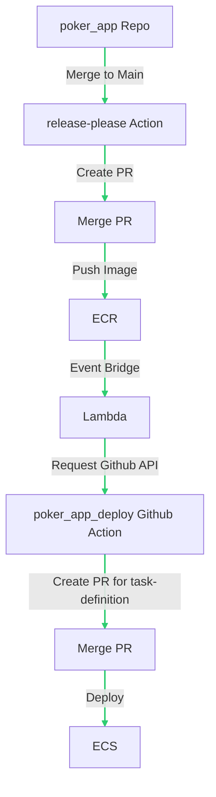

# mjex11/poker_app
A poker web app.
- Ruby version: 3.2.2
- Rails version: 7.0.4.3
# Deployment Flow
Deploy ECS with GitOps

# Configuration
```
bundle install
```
```
rails assets:precompile
```
```
rails s
```
# with docker
```
docker build . -t poker_app
```
```
docker run -e "SECRET_KEY_BASE=your_secret_key" -p 3000:3000 poker_app
```
# test
```
rspec
```
